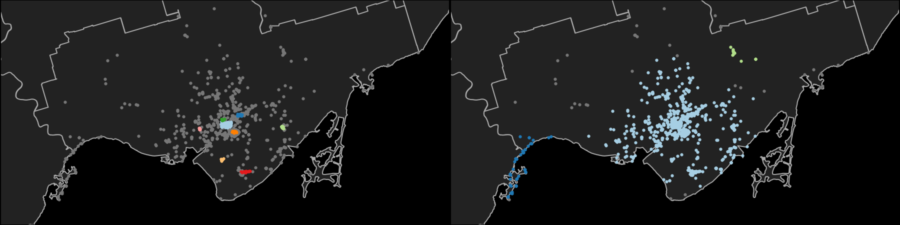
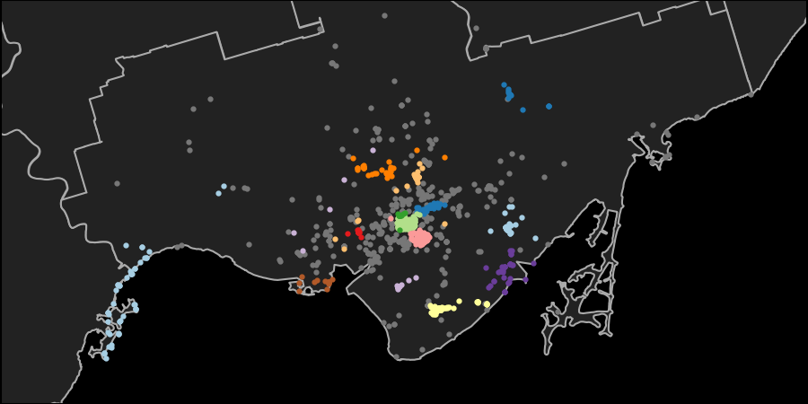

**********
SnapAssist
**********

Welcome to the repository for SnapAssist, the web application for perfect
picture planning!  SnapAssist leverages geotagged photo metadata scraped from
the `Flickr <https://www.flickr.com/>`_ to determine the most popular
photography viewpoints around the Greater Toronto area for any given subject
matter.  The app was previously served on Amazon AWS and has been taken down,
but a `demo of its operation <https://youtu.be/PinyQLDiJ44>`_ is on YouTube.

SnapAssist was created by Chenchong Charles Zhu as part of the Fall 2018 Insight
Data Science fellowship in Toronto.  Its companion presentation can also
be `found on YouTube <https://youtu.be/UKqM4mM3-Mw>`_.

How Does SnapAssist Work?
=========================

SnapAssist consists of two components: a set of scrapers to data mine
Flickr using its API and dump the cleaned results into a set of pandas data
frames (stored as HDF5), and a web application that performs the mapping.  More
information about the scrapers can be found in the Data Mining Flickr section.

In the web app, when a user enters a search term, the app performs a search for
the corresponding tags in the pandas tables[1]_.  Once the relevant photos are
found, their geolocations are passed to the OPTICS clustering algorithm 
(taken from the development version of scikit-learn) to determine high-density
clusters of photos.  For each cluster, the app calculates the number of photos,
average number of views per photo, and a cluster centre defined by the
views-weighted mean longitude and latitude of the cluster's photos.  The
clusters are ranked by the quantity::

    avg. views per photo in cluster / number of photos in cluster

which is a joint measure of the quality of the photos taken within a cluster and
how undersubscribed a cluster's location is (ideally, photographers want to
discover great shooting locations that aren't too popular!). Finally, all photos
and clusters are plotted on a map of Toronto using Folium (which useds
Leaflet.js in the backend).

SnapAssist uses geospatial clustering to find and characterize popular photo
locations.  This translates to finding clusters of higher density against a
background of lower density, which is a task for density-based algorithms like
`DBSCAN <http://scikit-learn.org/stable/modules/generated/sklearn.cluster.DBSCAN.html>`_.

DBSCAN determines clusters by picking a point from the data and determining
whether there are more than the minimum number of neighbouring points within a
radius ``epsilon``.  If so, the point is considered a core member of its
cluster.  It then performs the same check for all of the neighbouring points,
and this continues until no more points can be reached.  Points without enough
neighbours are considered background noise.  Here's a great animation from
`David Sheehan <https://dashee87.github.io/data%20science/general/Clustering-with-Scikit-with-GIFs/>`_
showing the process:

.. image:: https://dashee87.github.io/images/DBSCAN_tutorial.gif
    :alt: DBSCAN GIF by dashee
    :align: center

DBSCAN works well for clustering on a background of uniform density, but not for
one where the density changes.  This is because when the user sets the values of
``epsilon`` and minimum number of points, they effectively set a critical
density above which points will cluster.  In many situations for SnapAssist, the
density of photos decreases with distance away from the Toronto downtown core,
but clusters of photos exist in regions of both high and low density.  For
example, here are the locations of photos of the CN Tower clustered using DBSCAN
(clusters are represented by coloured points, background by grey points) using
a small ``epsilon`` (left) and a large ``epsilon`` (right):

Using too small an ``epsilon`` results in clustering near downtown Toronto and
the Toronto Islands, but not further out, while using too large an ``epsilon``
results in all of downtown Toronto forming one cluster.

To rectify this, SnapAssist uses the `OPTICS algorithm
<http://scikit-learn.org/dev/modules/clustering.html#optics>`_, which replaces
checking for neighbours within a fixed ``epsilon`` with a hierarchical
clustering algorithm that orders points by the minimum ``epsilon`` required to
reach their nearest neighbours.  The ordering and minimum ``epsilon`` can be
combined to create a dendrogram-like "reachability plot".  Cutting at any
particular ``epsilon`` in this plot is equivalent to clustering using DBSCAN
with the same ``epsilon``, but clusters can also be assigned by finding local
minima in reachability, then moving outward until the increase in reachability
moving from one point to the next becomes too high.  This latter method extracs
clusters from a background of **varying density**, exactly what we need to
cluster photos.

Here's the OPTICS clustering for the same photos from above; OPTICS picks out
clusters both in downtown Toronto and in the suburbs.

.. [1] Currently, exact keyword matching is used (with some intelligent
   handling of white space).  I had considered creating an embedded space of
   tags and using semantic similarity, but there is no obvious way to set a
   critical similarity beyond which two photos are considered different.
   Without this, there is no natural boundary for the number of photos to
   return to the user.

Requirements
============

The web app is compatible with Python 3.5 (and may work for Python 3.6+), and
requires the following packages::

    branca
    Cython
    Flask
    flickrapi
    folium
    h5py
    hdbscan
    numpy
    pandas
    tables
    scikit-learn
    unidecode

Data Mining Flickr
==================

Snapassist relies on two pandas HDF5 databases::

    master_table_processed.hdf5
    popular_table_processed.hdf5

which hold general photo metadata of all photos scraped, and camera model and
photo EXIF data of the most popular 25% of all photos scraped, respectively. 
Scraping for the EXIF data needs to be done photo-by-photo, making it
considerably more expensive than getting the general metadata, hence why it is
only done on the most popular photos.

To generate these tables, SnapAssist has a ``scrapers`` module, which is
accessed by the ``run_scraper_...py`` files in the root directory.  Details on
how to run each are in their respective docstrings.

All the scrapers require `Flickr API keys
<https://www.flickr.com/services/api/misc.api_keys.html>`_, which can either be
manually passed to the scraper, or stored in a ``secrets.py`` file that
contains the following::

    >>> # Flickr API key.
    >>> FLICKR_API_KEY = '<YOUR API KEY HERE>'
    >>> FLICKR_API_SECRET = '<YOUR API SECRET HERE'

If the keys are not manually passed, the scraper scripts will automatically
attempt to ``import secrets``, so include the path to your ``secrets.py`` in
your Python path.  I recommend running SnapAssist in a virtualenv, and adding a
.pth file to include ``secrets.py`` (see
`adding .pth files <https://docs.python.org/3/install/index.html#modifying-python-s-search-path>`_).

The overall scraping workflow (with generic table names) is

1. Run the general scraper::

      python run_scraper_1_general.py <START_DATE> <END_DATE> 'master_table.hdf5'-v

2. Run the EXIF scraper, which retrieves camera settings metadata for the 25%
   most popular photos found with the general scraper. Here, ``DIVISIONS`` is
   the number of blocks to subdivide the photos into, to avoid losing all the
   data already scraped by the EXIF scraper if it raises an exception.  A
   reasonable number for ``DIVISIONS`` is 10::

      python run_scraper_2_exif.py 'master_table.hdf5' <DIVISIONS> 'popular_table.hdf5'

3. In the Python interpreter of your choice, run the following to process the
   scraped data into pandas HDF5 tables usable by SnapAssist::

      >>> from snapassist.scrapers import postprocessor as ppc
      >>> read_and_preprocess_tables(
      ...     table_folder='./',
      ...     master_table='master_table.hdf5',
      ...     popular_table='popular_table.hdf5',
      ...     master_table_processed='master_table_processed.hdf5',
      ...     popular_table_processed='popular_table_processed.hdf5')

Deploying the Web App
=====================

Building OPTICS
---------------

Scikit-learn's `OPTICS module
<http://scikit-learn.org/dev/modules/generated/sklearn.cluster.OPTICS.html>`_
has not yet been released, so its code has been included under
``snapassist/sklearn_optics/``.  OPTICS needs to be built using `Cython
<http://cython.org/>`_ (which has C package dependencies); you can do this by
running::

    python setup.py build_ext --inplace

in the SnapAssist root folder.

This module will become deprecated when scikit-learn 0.21 is released.

Linking the Databases
---------------------

Before running the web app, you must tell SnapAssist where your metadata tables
are by setting the environmental variable::

    export FLICKR_TABLES_FOLDER='/PATH/TO/YOUR/FOLDER/'

Running the Web App
-------------------

To run the app locally, use the ``run_webapp.py`` script in the root directory.
On a server, I recommend using the `gunicorn <https://gunicorn.org/>`_ server,
which is launched using the command::

    gunicorn snapassist.web::app

To use gunicorn, you will need to add the ``snapassist`` root folder to your
Python path.

Credits
=======

This package was created with Cookiecutter_ and the `audreyr/cookiecutter-pypackage`_ project template.

.. _Cookiecutter: https://github.com/audreyr/cookiecutter
.. _`audreyr/cookiecutter-pypackage`: https://github.com/audreyr/cookiecutter-pypackage
